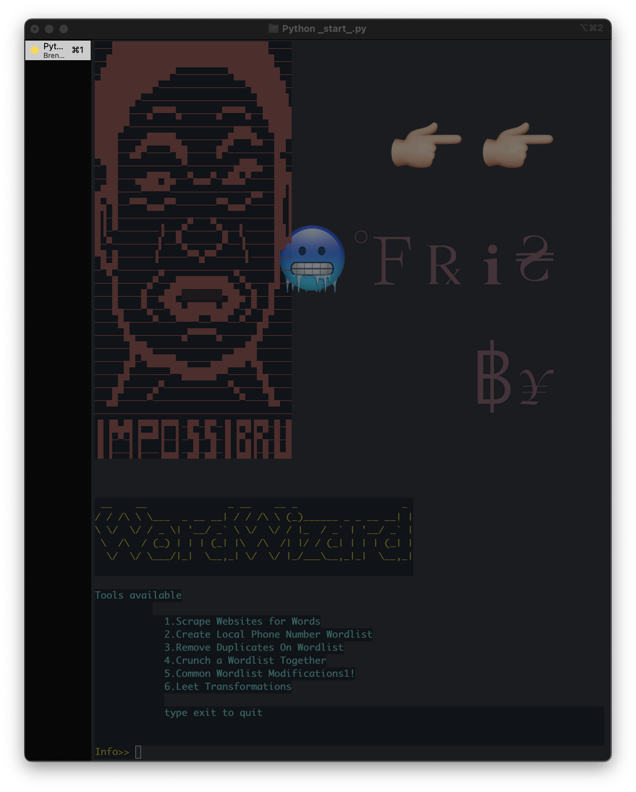

<h1 align='center'>WordWizard</h1>

--------------------------------
<h2 align='center'>Think Cewl, Crunch, and a few other wordlist tools in one app.</h2>

-------------------------------
<h3 align='center'>Modules Available</h3>
<ul>
<li>Scrape Websites for words</li>
<li>Remove Duplicates</li>
<li>Create phone number wordlists(Good for WiFi)</li>
<li>Common modifications like appending 1!, 1$ or Capitalizing a Specific Index</li>
<li>Common Leet Transformations</li>
<li>Crunch together found words</li>
</ul>

  

<h2 align='center'>Install</h2>
<ol align='center'>
  <li>git clone https://github.com/bfrisbyh92/WordWizard.git</li>
  <li>pip install requirements.txt</li>
</ol>
